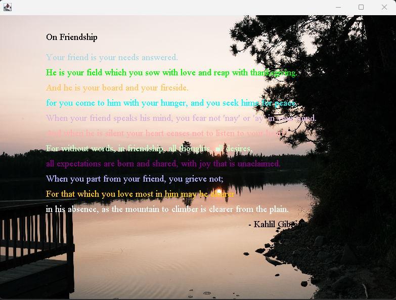

# Overview

This project gives you your first taste of writing Java applications using JFrame. You will write a simple program that will display a poem, an image, and change the colors of text. It should be a simple project and a good way to ease you into using Java.

__________________

# Required Skills:

-Basic of Java

-Header Comments

-JFrame, JPanel, graphics

-drawstring()

-setColor()

-loadin and using images

-ImageIcon class and Image class

_____________

# Requirements:

-Make an application that displays a poem over an image

 	-The poem must be at least 10 lines

 	-Do your best to choose an image that will help to illustrate the text of the poem

-You must change the color of the text at least 3 times in the poem.

________________
# Outcome

&nbsp;	

______________

Resources that I used: In Class resources and examples on StackOverFlow

______________

This is for Introduction to Java CSCI 1130-51 at North Hennepin Community College

